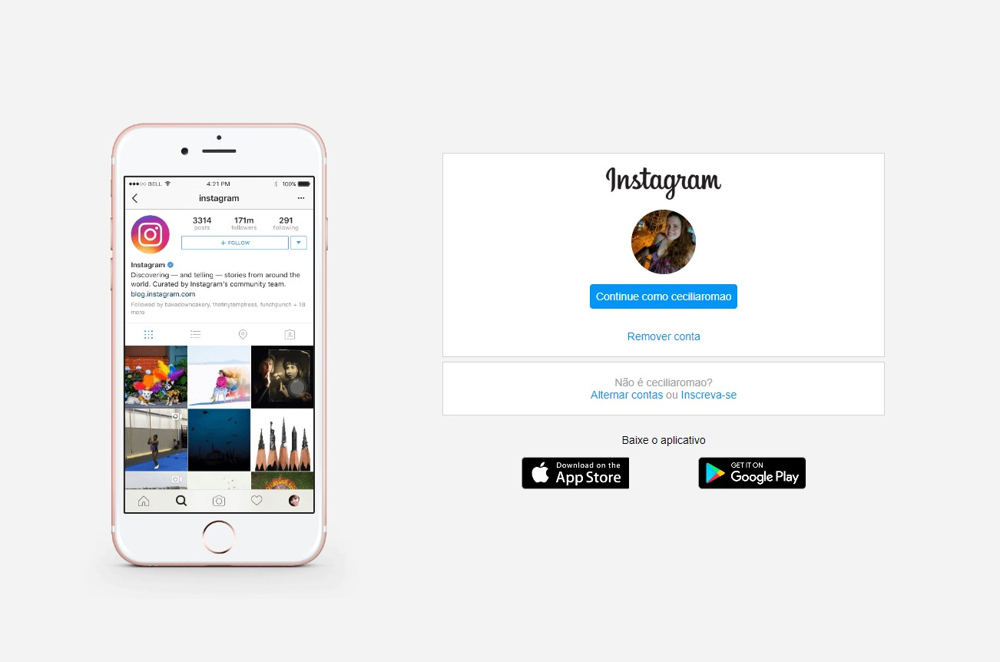

# Desafio prático realizado na plataforma [Digital Innovation One](https://web.digitalinnovation.one/home "Digital Innovation One")

  
   
  Recriando a interface de login do Instagram com CSS e HTML.

### Os requisitos são:

* [HTML básico](https://www.w3schools.com/html/)
* [CSS básico](https://developer.mozilla.org/pt-BR/docs/Web/CSS)

## 🚀 Let's code! 🚀
